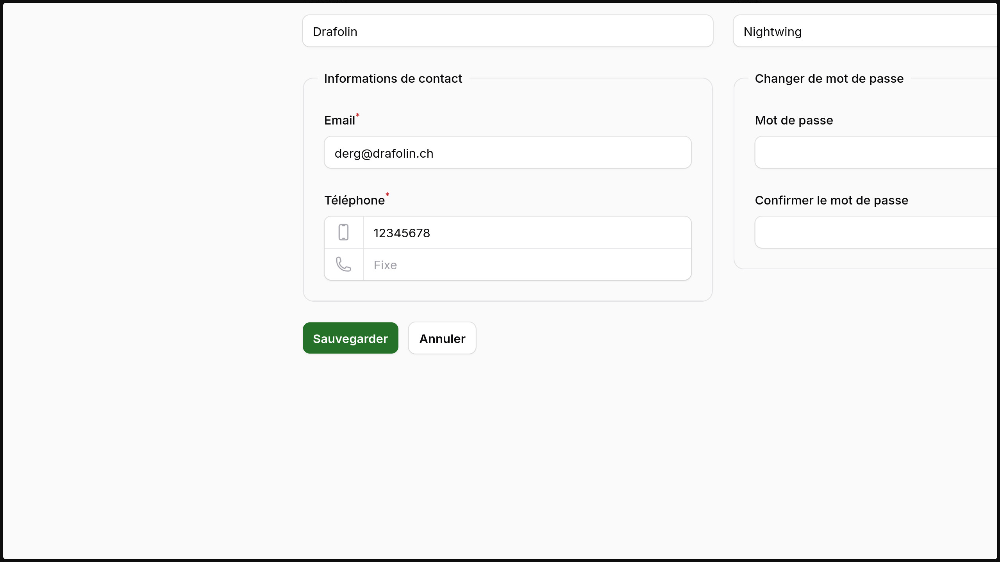

# A layout field that collapses space between components.
[](https://packagist.org/packages/drafolin/filament-collapse)
[](https://packagist.org/packages/drafolin/filament-collapse)


# Filament Collapse

The Collapse Group field is a layout field that collapses space between components. 
It is useful for grouping related fields together, such as phone numbers or start and end dates.



## Installation

You can install the package via composer:

```bash
composer require drafolin/filament-collapse
```

Optionally, you can publish the views using

```bash
php artisan vendor:publish --tag="filament-collapse-views"
```

## Usage

```php
<?php
use Drafolin\FilamentCollapse\FilamentCollapse;

public function form(Form $form)
{
    return form
        ->schema([
            FilamentCollapse::make([
                // Add fields here. Ideally, these fields should be related.
                // For now, it's only been tested with TextInput fields, and fields that inherit from it.
                TextInput::make('first_name')
                    ->label('First Name'), // Labels are transformed into placeholders.
                TextInput::make('last_name')
                    ->label('Last Name'),
            ])
            ->label('Collapse Group'), // This field is a regular field, so it also supports base filament properties.
        ]);
}
```

## Changelog

Please see [CHANGELOG](CHANGELOG.md) for more information on what has changed recently.

## Contributing

Everyone is welcome to contribute to this project. To do so, simply open an issue or a pull request.

## Credits

- [Dråfølin](https://github.com/drafolin)
- [All Contributors](../../contributors)

## License

The MIT License (MIT). Please see [License File](LICENSE.md) for more information.
